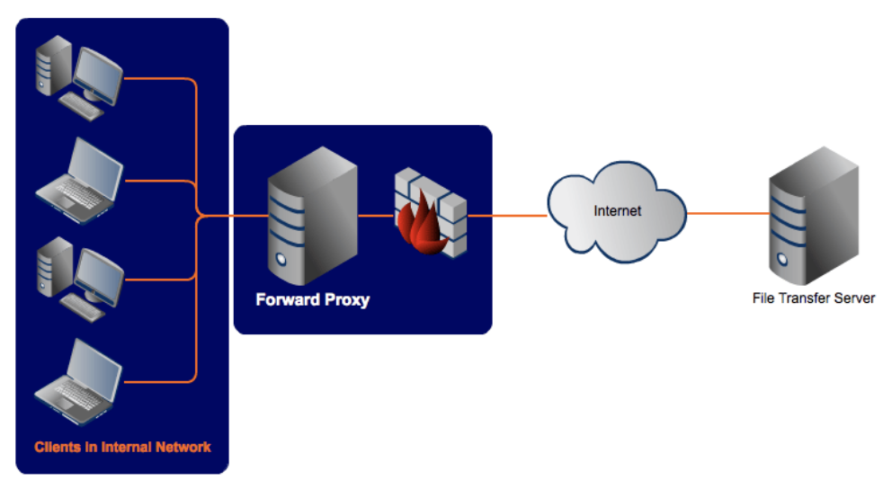
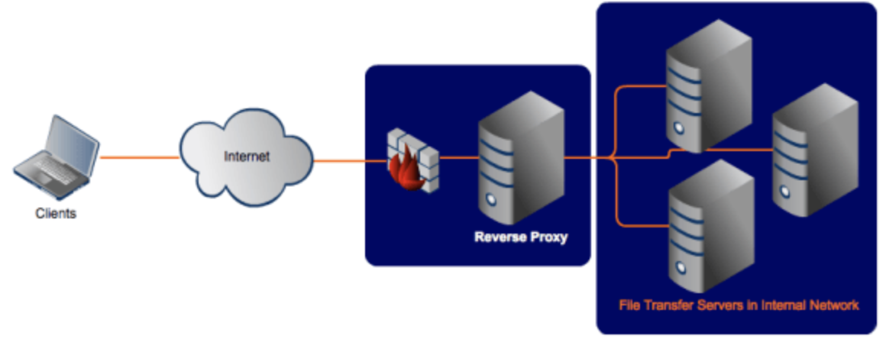

the purpose of forward and reverse proxies is to act on behalf of another machine — either a client, web server or other backend server, etc. In this case, the proxy acts as a middleman.

# forward proxy

example of forward proxy in a typical infra: \

all requests in internal network go through forward proxy (req can be denied).

From the POV of the file transfer server, it is the proxy server that issued the request, not the client. So when the server responds, it addresses its response to the proxy.

the proxy servers keeps track of requests, responses, sources and destinations. different clients can send out requests to different servers through the forward proxy and the proxy will intermediate for all of them.

the proxy serves as a single point of access and control, making it easier for you to enforce authentication, SSL encryption or other security policies.

## limitation
client computers aren't always the only ones you find in your internal network. Sometimes, you also have servers. And when those servers have to provide services to external clients (for example, field staff who need to access files from your FTP server), a more appropriate solution would be a reverse proxy.

# reverse proxy

While a forward proxy proxies on behalf of clients (or requesting hosts), a reverse proxy proxies on behalf of servers. A reverse proxy accepts requests from external clients on behalf of servers stationed behind it as shown above.

Just like forward proxy servers, reverse proxies also provide a single point of access and control. You typically set it up to work alongside one or two firewalls to control traffic and requests directed to your internal servers.

In most cases, reverse proxy servers also act as load balancers for the servers behind them. Load balancers play a crucial role in providing high availability to network services that receive large volumes of requests. When a reverse proxy performs load balancing, it distributes incoming requests to a cluster of servers, all providing the same kind of service.

src:
- https://www.jscape.com/blog/forward-proxy-vs-reverse-proxy