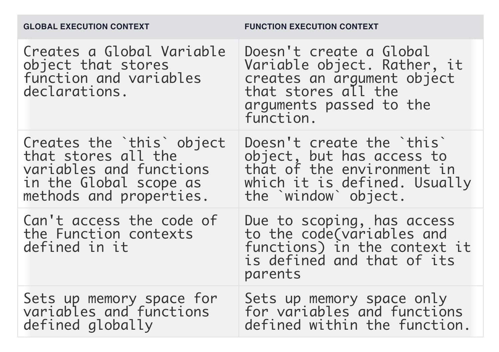

# Execution context
> `"The Execution Context contains the code that's currently running, and everything that aids in its execution."`

there are 2 kinds:
- Global Execution Context (GEC)
- Function Execution Context (FEC)

## How are execution contexts created?
There are 2 phases:
- `creation`
- `execution`

# Creation Phase

The Execution Context is first associated with an `Execution Context Object` (ECO). The Execution Context Object stores data which the code in the Execution Context uses during run-time.

The creation phase occurs in 3 stages, during which the properties of the Execution Context Object are defined and set. These stages are:
- Creation of the Variable Object (VO)
- Creation of the Scope Chain
- Setting the value of the `this` keyword

**Variable Object (VO)**
An object-like container, stores variables and function declarations defined within that Execution Context.

in GEC:
- stores variable declared as a property in VO
- stores function declared as a property in VO, All function declarations are stored and made accessible inside the VO, even before the code starts running.

in FEC:
- does not construct VO
- generates an array-like object called the 'argument' object, which includes all of the arguments supplied to the function

*This process of storing variables and function declaration in memory prior to the execution of the code is known as `Hoisting`.*

This explains why:
- you can call functions in the same execution context that you have yet to declare.
- variables on the other hand, are stored in VO initially as `undefined`.

**Scope Chain**

`Scope in JavaScript is a mechanism that determines how accessible a piece of code is to other parts of the codebase. Scope answers the questions: from where can a piece of code be accessed? From where can't it be accessed? What can access it, and what can't?`

Each FEC creates an environment where variables/functions can be accessed (a.k.a scoping). Javascript uses lexical scoping, i.e. `the ability for a function scope to access variables from the parent scope.`

The scope chain is created.

**Setting the value of the `this` keyword**

The JavaScript this keyword refers to the scope where an Execution Context belongs. Once the scope chain is created, the value of `this` is initialized by the JS engine.

In GEC:
- `this` refers to the global object — which is the window object.
- functions/variables are assigned in the global object - `window`

In FEC:
- does not create `this` object.
- references `this` from the environment it is defined in.

# Execution Phase
At this stage, the JavaScript engine reads the code in the current Execution Context once more, then updates the VO with the actual values of these variables. Then the code is parsed by a parser, gets transpired to executable byte code, and finally gets executed.

## First, understand the execution stack, aka call stack
When scripts load in the browser, the Global context is created and is placed at the bottom of the execution stack.

For each function call, a new FEC is created for that function and is placed on top of the currently executing Execution Context.

The Execution Context at the top of the Execution stack becomes the active Execution Context, and will always get executed first by the JS engine.

# Summary

reference:
- https://www.freecodecamp.org/news/execution-context-how-javascript-works-behind-the-scenes/

