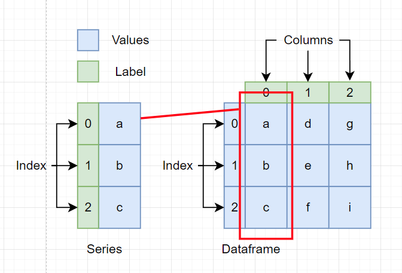

# Learning about Series and Dataframe in Pandas

Takeaways from reading pandas docs: https://pandas.pydata.org/pandas-docs/stable/user_guide/dsintro.html




As seen from above:
- a series is just a table column. The values (blue box) is labelled with `index` (green box).
- a dataframe is just the table itself. The values (blue box) is labelled with `columns` (green box). **Note that for a DF, the value is a series.**

A series and dataframe are both dict-like
- a dict can select values by key. It can check for existance of keys.
- a series/df can select values by label (index or column). It can check for existance by label.

## Series
```python
s = pd.Series(['a', 'b', 'c', 'd'])  # series from list. Default index values.
s = pd.Series(['a', 'b', 'c', 'd'], index=[0, 1, 2, 3])  # series from list. Declared index values
s = pd.Series({0: 'a', 1: 'b', 2: 'c', 3: 'd'})  # series from dict

"""
0    a
1    b
2    c
3    d
dtype: object
"""

# using index label, you can access values in a ndarray-like manner by slicing or indexing
s[0]  # a
s[1:]  # even slicing is possible.
"""
1    b       
2    c       
3    d       
dtype: object
"""
# it is also dict-like
s.get(0, None)  # just like a dictionary. except the key in this context is the label
```

## Dataframe
```python
d = {
    "one": pd.Series([1.0, 2.0, 3.0], index=["a", "b", "c"]),
    "two": pd.Series([1.0, 2.0, 3.0, 4.0], index=["a", "b", "c", "d"]),
}  # "one" and "two" are the column values
df = pd.DataFrame(d)
"""
   one  two
a  1.0  1.0
b  2.0  2.0
c  3.0  3.0
d  NaN  4.0
"""
d = {"one": [1.0, 2.0, 3.0], "two": [1.0, 2.0, 3.0, 4.0]}  # dict of list. but a list of dict works too!
df = pd.DataFrame(d)
"""
   one  two
0  1.0  4.0
1  2.0  3.0
2  3.0  2.0
3  4.0  1.0
"""

# in a dict-like manner, you can use your column labels to select different columns/series
df['one']  # df.get('one') works too
"""
0  1.0
1  2.0
2  3.0
3  4.0
"""

# remember that df is just composed of many series. df['one'] is just a series! you can then use it like a normal series and do whatever index slicing you want
df['one'][0:2]  # works well :)
```

For learning about [Indexing / Selecting](https://pandas.pydata.org/pandas-docs/stable/user_guide/indexing.html), I find the documentation to be good enough. It is an easy read if the above basic data structures are understood well.
