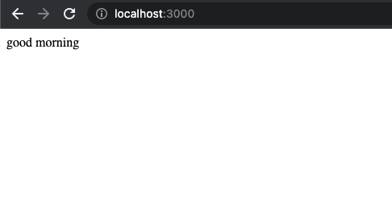
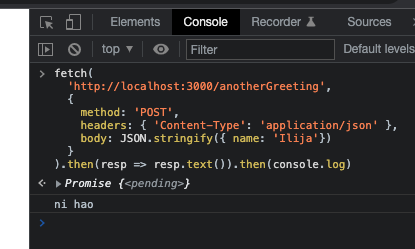
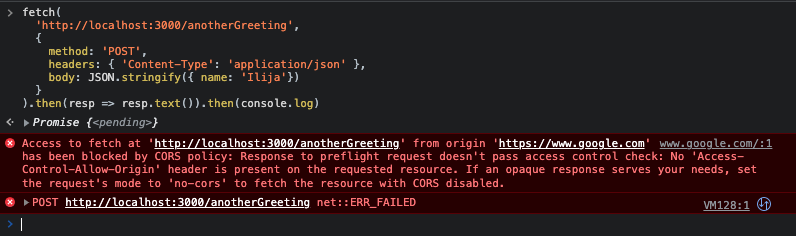
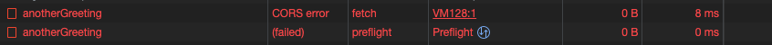
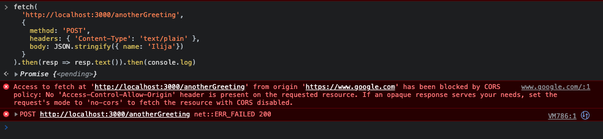
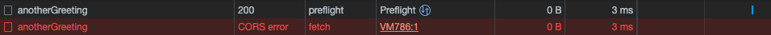
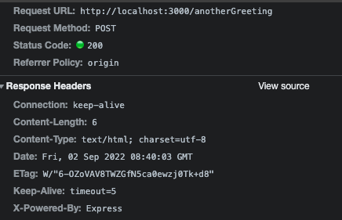

# Same Origin Policy
good reads:
- https://www.rfc-editor.org/rfc/rfc6454
- https://developer.mozilla.org/en-US/docs/Web/Security/Same-origin_policy
- https://ieftimov.com/posts/deep-dive-cors-history-how-it-works-best-practices/


# About Origins
Origin = `protocol` + `domain` + `port`. E.g:
- `http://example.com/app1/index.html` is the same origin as `http://example.com/app2/index.html`.
  - same protocol (http)
  - same domain (example.com)
  - path does not matter
- `http://api.example.com` is NOT the same origin as `http://example.com`
  - https://stackoverflow.com/questions/26724137/do-i-need-to-enable-cors-when-my-api-is-on-a-subdomain-of-my-main-website
  - subdomains are considered another origin

Let's say that I’m a browser. I load a website from a URL. Whatever server / origin / source that it comes from, let's call that `origin A`.

The website from `origin A` also needs resources from another server, `origin B`. Since `origin A` and `origin B` are not the same, this is a `cross origin access`.

`Same Origin Policy` will control such `cross origin` interactions.

# why is cross origin access bad?
- https://ieftimov.com/posts/deep-dive-cors-history-how-it-works-best-practices/#the-many-dangers-of-cross-origin-requests

# What does Same Origin Policy control?
**Basically, when a browser implements SOP, all interactions between 2 different origins are NOT allowed. But that is not feasible for the web, so here are some exceptions to the rule.**

## Exceptions to the rule... What is allowed?
Loading of resources that are embedded in the pages via `<script>`, ``, `<video>`, `<audio>` are typically allowed. (`<iframe>` is a special one – as it’s purpose is to literally load a different page inside the frame, its cross-origin framing can be controlled by using the X-Frame-options header.)

Also note that links, redirects and form submissions are generally allowed too.

*"The same-origin policy generally controls the access that JavaScript code has to content that is loaded `cross-domain`. `Cross-origin` loading of page resources is generally permitted. For example, the SOP allows embedding of images via the `` tag, media via the `<video>` tag and JavaScript includes with the `<script>` tag. However, while these external resources can be loaded by the page, any JavaScript on the page won't be able to read the contents of these resources."* - [portswigger](https://portswigger.net/web-security/cors/same-origin-policy)

## what is NOT allowed?
*"Broadly, one origin is permitted to send information to another origin, but one origin is not permitted to receive information from another origin. The prohibition on receiving information is intended to prevent malicious web sites from reading confidential information from other web sites, but also prevents web content from legitimately reading information offered by other web sites."* - [w3](https://www.w3.org/Security/wiki/Same_Origin_Policy)

Generally, most http `requests`/`responses` to other origins are not allowed.
- [simple requests](https://developer.mozilla.org/en-US/docs/Web/HTTP/CORS#simple_requests) are NOT blocked. the browser allows those to be sent.
- requests that are not deemed `simple requests` would trigger a CORS preflight, and usually blocked unless headers are configured correctly.
- responses are all blocked by default. `cross origin reads` are blocked.

> The motivation of the preflight is to make sure that the server is CORS aware (there might be legacy servers that do not implement CORS)

## Practical example
> heavily referenced from https://ieftimov.com/posts/deep-dive-cors-history-how-it-works-best-practices/#enter-cors

Lets define a simple express server.
```javascript
const express = require('express')
const app = express()
const port = 3000

app.get('/', (req, res) => {
  res.send('good morning')
})

app.post('/anotherGreeting', (req, res) => {
  res.send(`ni hao`)
})

app.listen(port, () => {
  console.log(`Example app listening on port ${port}`)
})
```



Now if we were to make the same post request from google.com...



and we can tell that a preflight request was sent.



Remember, simple requests are not blocked. simple requests also do not have a preflight OPTIONS request. This request that we sent was deemed "complex" by the browser. Primarily due to `headers: { 'Content-Type': 'application/json' },`. When `Content-Type` is changed to `text/plain`, the browser will deem it as a simple request.





As we can see, simple requests are not blocked. But what is blocked is the response! We can tell that response was 200, but the browser still threw a CORS error. This reinforces what was mentioned earlier... `cross origin reads` are blocked.

Now an alternative to using the hacky `text/plain` way is to allow the preflight OPTIONS request on the server side.

```javascript
app.use(function(req, res, next) {
  res.header('Access-Control-Allow-Origin', '*');
  res.header('Access-Control-Allow-Methods', 'GET, PUT, POST, DELETE, OPTIONS');
  res.header('Access-Control-Allow-Headers', 'Content-Type, Authorization, Content-Length, X-Requested-With');

  //intercepts OPTIONS method
  if ('OPTIONS' === req.method) {
    //respond with 200
    res.send(200);
  }
  else {
  //move on
    next();
  }
});
```


Now it works :)
